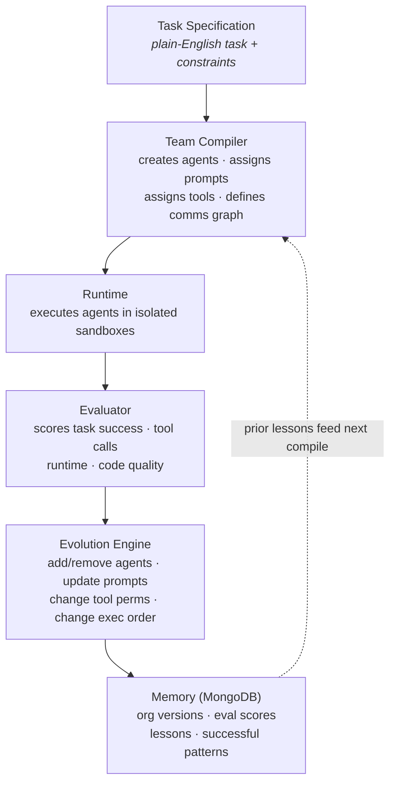
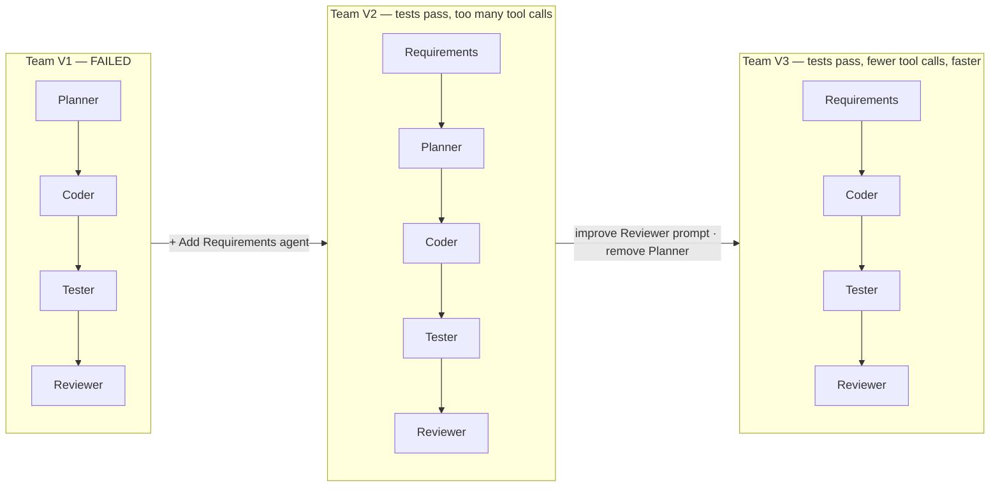

# Architecture

> "We are not optimizing answers. We are evolving AI engineering organizations."

The system treats an **AI engineering team as an artifact that can be compiled,
executed, scored, and mutated.** A plain-English task is compiled into an
organization of agents; the organization runs in isolated sandboxes; the run is
scored; weaknesses drive structural mutations; and every version, score, and
lesson is persisted so the next compilation starts smarter. The result is a
closed loop that evolves the *team*, not just the answer.

---

## Core Pipeline

The pipeline is a six-stage loop. Each stage hands a well-defined artifact to
the next, and the final stage feeds memory back into the first.

### Stage responsibilities

1. **Task Specification** — A plain-English engineering task plus its domain,
   constraints, and acceptance criteria (e.g. *"Build a rate limiter for an API
   endpoint; existing tests must keep passing; new functionality must satisfy
   acceptance criteria"*).
2. **Team Compiler** — Turns the task into an organization: it **creates the
   agents**, **assigns each a prompt**, **assigns each a tool permission set**,
   and **defines the communication graph** between them. Output is an
   `OrganizationSpec` (the `OrganizationHarness` IR).
3. **Runtime** — Executes the agents **inside isolated sandboxes** (per-agent
   working environments), following the communication graph and execution order.
4. **Evaluator** — Scores the run along four axes: **task success**, **number of
   tool calls**, **runtime**, and **code quality**. Produces an evaluation
   result with per-metric scores and a pass/fail threshold.
5. **Evolution Engine** — Reads the evaluation and proposes structural changes:
   **add agents, remove agents, update prompts, change tool permissions, change
   execution order**. Each proposal is a new candidate organization version.
6. **Memory (MongoDB)** — Persists **organization versions, evaluation scores,
   lessons learned, and successful organization patterns**. This memory is fed
   back into the compiler as prior lessons, closing the loop.

---

## OrganizationSpec

The compiler emits an `OrganizationSpec` — the canonical description of a team.
It has six fields:

| Field                   | What it captures                                              |
| ----------------------- | ------------------------------------------------------------- |
| **Agents**              | The roles in the team (e.g. Requirements, Coder, Tester...)   |
| **Prompts**             | The instruction/prompt assigned to each agent                 |
| **Tool Permissions**    | Which tools each agent is allowed to call                     |
| **Communication Graph** | Who talks to whom (edges, topology, shared memory)            |
| **Execution Order**     | The order/phasing in which agents run                         |
| **Evaluation Metrics**  | The metrics and weights used to score the organization's runs |

---

## Evolution Operations

The Evolution Engine mutates an `OrganizationSpec` into a new version using a
small, well-defined set of operations:

- **`+` Add agent** — introduce a new role (e.g. add a Requirements agent).
- **`-` Remove agent** — drop a redundant role (e.g. remove the Planner).
- **Change prompt** — rewrite or expand an agent's instructions.
- **Change tool access** — grant or revoke an agent's tool permissions.
- **Change execution order** — reorder phases / communication edges.
- **Adjust execution budget** — raise or lower an agent's tool-call budget.

Each mutation produces a new candidate organization version, which is run and
scored. A validation gate accepts the candidate only if it improves on the
parent without regressing the must-hold metrics (e.g. tests passing).

---

## Evolution in Action: V1 → V2 → V3

Evolution adds *and removes* agents across generations while the scored metrics
improve. The canonical demo run:

- **V1** `[Planner, Coder, Tester, Reviewer]` — **fails**. The team lacks
  grounding in the actual requirements.
  Mutation: **`+` add a Requirements agent**.
- **V2** `[Requirements, Planner, Coder, Tester, Reviewer]` — **tests pass**, but
  the team makes **too many tool calls**.
  Mutations: **change the Reviewer prompt** and **`-` remove the Planner**
  (its responsibilities collapse into Requirements + Coder).
- **V3** `[Requirements, Coder, Tester, Reviewer]` — **tests pass**, with
  **fewer tool calls** and **faster execution**. Net result across generations:
  one agent added, two structural mutations, and a strictly better team.

---

## Sponsor Mapping

Each sponsor technology owns a distinct part of the loop:

| Sponsor          | Role in the loop                                                                            |
| ---------------- | ------------------------------------------------------------------------------------------- |
| **Gemini**       | Team compilation, prompt generation, agent mutations, and code generation during execution |
| **MongoDB**      | Persistent organization memory, evaluation history, and learned organization patterns      |
| **DigitalOcean** | Parallel sandbox execution and isolated worker environments                                 |

---

## See Also

- [`architecture_diagrams.md`](./architecture_diagrams.md) — ASCII deep-dives of
  each stage (compiler internals, runtime executor, scoring, weakness mining,
  mutators, validation gate, the full evolution loop, MongoDB collections, and
  infrastructure).
