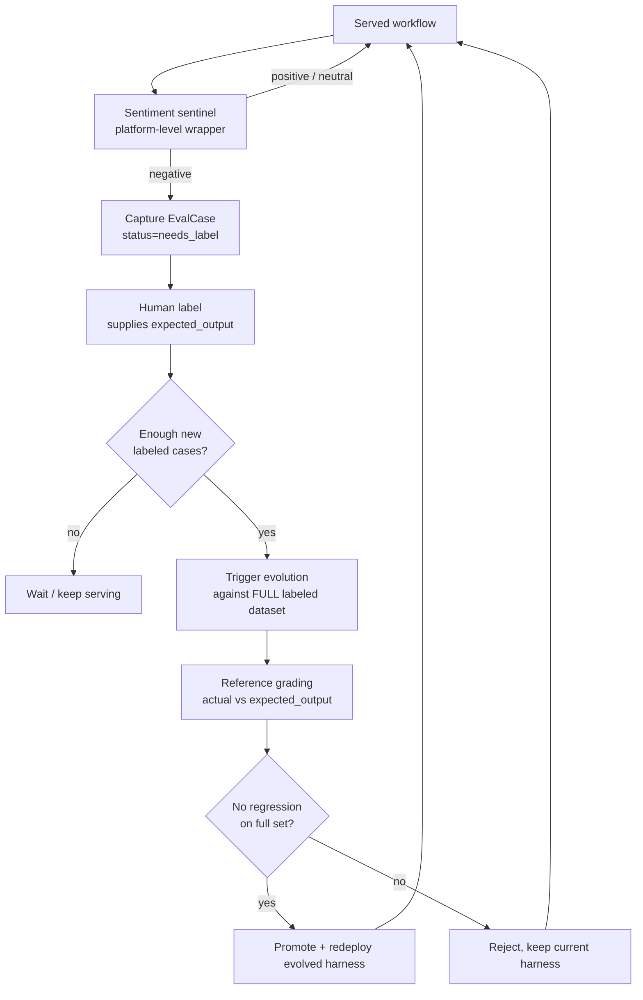

# Production Feedback Flywheel

## Purpose

Evolution needs a signal. The harness can mutate prompts, agents, tools, and
policies all day, but without a ground truth to grade against, it is optimizing
blind.

The Feedback Flywheel is how a *served* workflow generates its own ground truth.
Every production interaction is watched. When a user is unhappy, the interaction
is captured as a candidate eval case. A human supplies the answer that *should*
have been given. Once enough of those accumulate, evolution re-runs against the
enriched dataset, grades candidates reference-against the human-approved answers,
and only redeploys if nothing regresses.

The product is no longer "evolve a team once." It is a **self-evolving harness
for agentic workflows** that keeps getting better from real usage.

---

## The Loop

```text
serve workflow
    |
    v
sentiment sentinel  (platform-level wrapper, NOT a workflow node)
    |
    | negative sentiment?
    v
capture EvalCase  (status=needs_label: input + context_snapshot + actual_output)
    |
    v
human label       (admin or end user supplies expected_output -> status=labeled)
    |
    | enough new labeled cases? (threshold / batch)
    v
trigger evolution (re-run against the FULL labeled dataset)
    |
    v
reference grading (actual vs expected_output, per case)
    |
    | no regression on the full labeled set?
    v
gate + redeploy   (promote evolved harness; else reject and keep current)
```



---

## Architecture

### The sentiment sentinel is platform-level, not a node

The sentinel that watches for negative sentiment is a **platform-level wrapper**
around every served workflow. It is deliberately *not* an agent or node inside
the Organization Harness IR.

This matters: the evolution engine is allowed to add, remove, and rewire nodes.
If the sentinel were a node, the optimizer could legitimately decide to delete
it — and silently sever the feedback signal it depends on. By living outside the
IR, on the serving layer, the sentinel is **exempt from evolution** and the
flywheel cannot optimize away its own data source.

In the current implementation the sentinel is realized as a capture endpoint on
the serving/observability layer (`src/observability/server.py`,
`POST /api/eval-cases/capture`). It classifies sentiment with a simple negative
gate:

- explicit negative sentiment (`sentiment` starts with `neg`, or is `bad` /
  `unhappy`), or
- any free-text feedback present with no sentiment label set.

Non-negative interactions are ignored (`{"status": "ignored"}`) — the dataset
only grows from real dissatisfaction. (Replacing this rule-based gate with an
LLM sentiment classifier is a straightforward future swap; the wiring point is
unchanged.)

### Two evaluation modes feed the same dataset

The flywheel produces **reference** eval cases (input + human-approved
expected_output). These are graded deterministically-in-spirit: the evolved
agent's actual output is compared *against the expected output* by an LLM
reference grader. This is the higher-signal of the two evaluation modes the
platform supports (see `docs/07_evaluation.md`):

1. **Reference / ground-truth grading** — when an expected output exists
   (user-provided up front, or captured-then-labeled by the flywheel). Graded by
   `GeminiJudge.grade_against_expected()`.
2. **LLM-as-judge (label-free)** — when no expected output exists, the run is
   judged against the harness's success conditions and binary checks by
   `GeminiJudge.grade()`.

The flywheel's whole job is to convert mode (2) situations (unlabeled production
traffic) into mode (1) data (labeled references) so evolution gets a sharper
gradient over time.

### Storage: MongoDB `eval_cases`

Cases live in the MongoDB collection **`eval_cases`** (one document per case),
managed by `MemoryStore` in `src/memory/store.py`:

- `save_eval_case` — upsert
- `list_eval_cases(status=, agent_id=)` — filtered listing
- `count_eval_cases(agent_id=)` — `{needs_label, labeled, total}`
- `get_labeled_cases(agent_id=)` — the references usable for grading/evolution
- `label_eval_case(case_id, expected_output, labeled_by=)` — flip to labeled

There is **no vector store in the MVP**. Embedding cases for dedup and
similar-case retrieval is a deliberate *future* optimization — DigitalOcean's
managed MongoDB does not offer Atlas `$vectorSearch`, so similarity retrieval
would need an external index. For the MVP, exact/filtered queries over
`eval_cases` are sufficient.

---

## EvalCase Schema

Defined in `src/eval_dataset/models.py`:

```python
@dataclass
class EvalCase:
    agent_id: str                      # which served agent/workflow produced it
    input: str                         # the user input that triggered the run
    context_snapshot: Dict[str, Any]   # frozen context the agent saw (see below)
    expected_output: Optional[str]     # human-approved answer (None until labeled)
    actual_output: Optional[str]       # what the agent actually produced
    status: str = "needs_label"        # needs_label -> labeled
    source: str = "production_negative" # or "user_provided"
    feedback: str = ""                 # the negative-sentiment comment / signal
    sentiment: str = ""                # e.g. "negative"
    id: str                            # "ec-<hex>"  (stored as Mongo _id)
    created_at: str                    # ISO-8601 UTC
    labeled_at: Optional[str]          # set on label()
    labeled_by: Optional[str]          # "admin" or the end user
```

Lifecycle constants: `status` is `needs_label` then `labeled`; `source` is
`production_negative` (captured by the sentinel) or `user_provided` (supplied
up front by the user).

The `context_snapshot` is the **frozen context** the agent saw at serve time —
whatever grounding the workflow consumed (retrieved docs, account/billing state,
tool results). Freezing it makes the case **replayable**: evolution can re-run a
candidate harness against the exact same context that produced the original
complaint, so any improvement is attributable to the harness, not to drift in
the underlying data.

`label()` sets `expected_output`, flips `status` to `labeled`, and stamps
`labeled_at` / `labeled_by`.

---

## Trigger Policy

The flywheel is **not** a per-negative panic loop. Re-evolving on every raw
complaint would be noisy, expensive, and would chase individual anecdotes.

The policy:

1. **Only labeled cases drive evolution.** A raw `needs_label` capture is a
   signal that *something* went wrong, not a specification of what "right" looks
   like. Until a human supplies `expected_output`, the case cannot grade a
   candidate, so it cannot move evolution.
2. **Trigger on a threshold / batch of new labeled cases**, not on each one. Wait
   until a meaningful batch of fresh labels has accumulated for an agent, then
   kick off one evolution run that learns from all of them at once.
3. **Gate against the FULL labeled dataset.** The evolved candidate must be
   graded against *every* labeled case for that agent — not just the new ones —
   and must show **no regression** on previously-passing cases before it can be
   promoted. This prevents fixing the latest complaint at the cost of breaking
   older, already-correct behavior.
4. **Redeploy only on a clean gate.** If the candidate regresses any labeled
   case, reject it and keep the current harness serving.

This mirrors the existing validation-gate philosophy (`docs/13_proposal_validation.md`):
no promotion without a non-regression check against the protected set. Here the
"protected set" is the full corpus of human-approved eval cases.

> Implementation note: `eval_cases` storage, the negative-sentiment capture
> sentinel, labeling, and reference grading
> (`GeminiJudge.grade_against_expected`) are implemented today. The batch
> threshold and the automatic capture → label → re-evolve scheduler are the
> orchestration layer that closes the loop end-to-end; the data plane and the
> grader they depend on are already in place.

---

## Worked Example: FinOps GCP Agent

A served agent answers GCP cost questions. A finance user asks why their bill
jumped and how to cut it. The first answer is vague, the user thumbs it down,
and the flywheel turns.

### 1. Serve + capture (sentinel fires)

The user's interaction is captured as a `needs_label` case:

```json
{
  "agent_id": "finops-gcp-cost-advisor",
  "input": "Our GCP bill went up ~40% last month. Why did it go up, and what are the top things we can do to cut it?",
  "context_snapshot": {
    "billing_period": "2026-05",
    "total_cost_usd": 18420.55,
    "prev_period_cost_usd": 13180.10,
    "top_services": [
      {"service": "Compute Engine",       "cost_usd": 9120.40, "delta_pct": 62},
      {"service": "Cloud SQL",            "cost_usd": 3340.00, "delta_pct": 11},
      {"service": "BigQuery (on-demand)", "cost_usd": 2870.15, "delta_pct": 48},
      {"service": "Cloud Storage",        "cost_usd": 1290.00, "delta_pct": 4},
      {"service": "Networking egress",    "cost_usd": 1800.00, "delta_pct": 35}
    ],
    "resources": [
      {"type": "n2-standard-16", "count": 12, "avg_cpu_util_pct": 9,  "committed_use": false},
      {"type": "n2-standard-8",  "count": 20, "avg_cpu_util_pct": 22, "committed_use": false},
      {"persistent_disks_unattached_gb": 4200},
      {"bigquery_full_table_scans_last_30d": 318}
    ]
  },
  "actual_output": "Your bill went up because you used more resources. Consider deleting things you don't need and turning off idle VMs.",
  "feedback": "Useless — no numbers, no idea which services actually drove it.",
  "sentiment": "negative",
  "status": "needs_label",
  "source": "production_negative"
}
```

The `context_snapshot` freezes the exact billing/resource state the agent saw,
so the case is replayable later.

### 2. Label (human supplies expected_output)

A FinOps admin reviews the case and writes the answer the agent *should* have
produced — a structured, ranked set of cost-saving recommendations with dollar
estimates and explicit attribution of the increase. The case flips to
`labeled`:

```json
{
  "expected_output": {
    "diagnosis": "Spend rose $5,240 (40%). ~$3,490 of the increase is Compute Engine (12x n2-standard-16 at 9% CPU — heavily over-provisioned). BigQuery on-demand rose $930 from 318 full-table scans. Egress rose $470.",
    "recommendations": [
      {
        "rank": 1,
        "action": "Rightsize / consolidate the 12 idle n2-standard-16 VMs (9% avg CPU) to n2-standard-8 or fewer instances.",
        "est_monthly_savings_usd": 3800,
        "rationale": "These VMs drive most of the Compute Engine delta and are <10% utilized."
      },
      {
        "rank": 2,
        "action": "Buy 1-year committed-use discounts for the steady-state n2-standard-8 fleet.",
        "est_monthly_savings_usd": 950,
        "rationale": "20 always-on VMs with no CUD; ~30% discount applies."
      },
      {
        "rank": 3,
        "action": "Move repeated BigQuery full-table scans to partitioned/clustered tables or flat-rate slots.",
        "est_monthly_savings_usd": 700,
        "rationale": "318 full scans in 30d at on-demand pricing."
      },
      {
        "rank": 4,
        "action": "Delete 4,200 GB of unattached persistent disks.",
        "est_monthly_savings_usd": 170,
        "rationale": "Unattached disks bill at full rate with zero value."
      }
    ],
    "total_est_monthly_savings_usd": 5620
  },
  "status": "labeled",
  "labeled_by": "admin",
  "labeled_at": "2026-06-02T14:11:09Z"
}
```

### 3. Re-evolve + reference grade

Once a batch of such labeled FinOps cases accrues, evolution re-runs candidate
harnesses against the **frozen `context_snapshot`** for each case and grades
each candidate's `actual_output` against the labeled `expected_output` via
`GeminiJudge.grade_against_expected(input, actual_output, expected_output)`,
which returns:

```json
{"match": true|false, "score": 0.0-1.0, "missing": ["..."], "rationale": "<one sentence>"}
```

**Reference-based grading** here means the grader is not asking "is this a good
generic answer?" — it asks "does the actual output match the *specific*
human-approved expected output for this exact input and context?" For the
FinOps case, a candidate that returns vague advice scores low and `missing`
lists the omitted points (dollar estimates, the over-provisioned
n2-standard-16 fleet, the BigQuery scan pattern). A candidate that produces a
ranked list of recommendations with $ estimates that line up with the expected
output scores high and `match` is true.

### 4. Gate + redeploy

The candidate is graded against the **full** labeled FinOps dataset. If it
improves the newly-labeled cases and regresses none of the previously-passing
ones, it is promoted and redeployed. Otherwise it is rejected and the current
harness keeps serving. The next negative interaction starts the flywheel again.

---

## Related Docs

- `docs/00_vision.md` — the self-evolving-harness framing and where the flywheel fits.
- `docs/07_evaluation.md` — the two evaluation modes and the real LLM judge.
- `docs/09_gemini_integration.md` — the live LLM backends (Claude Vertex / Gemini API).
- `docs/13_proposal_validation.md` — the validation-gate philosophy the trigger policy inherits.
