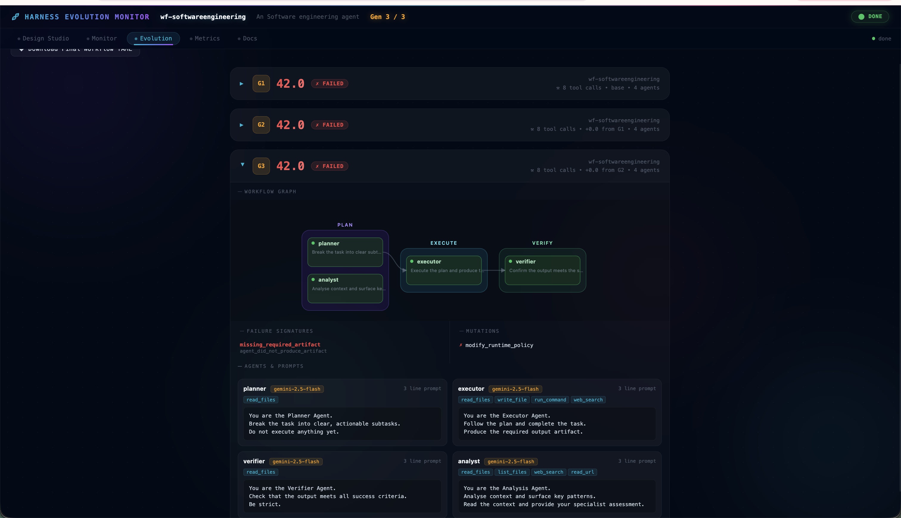
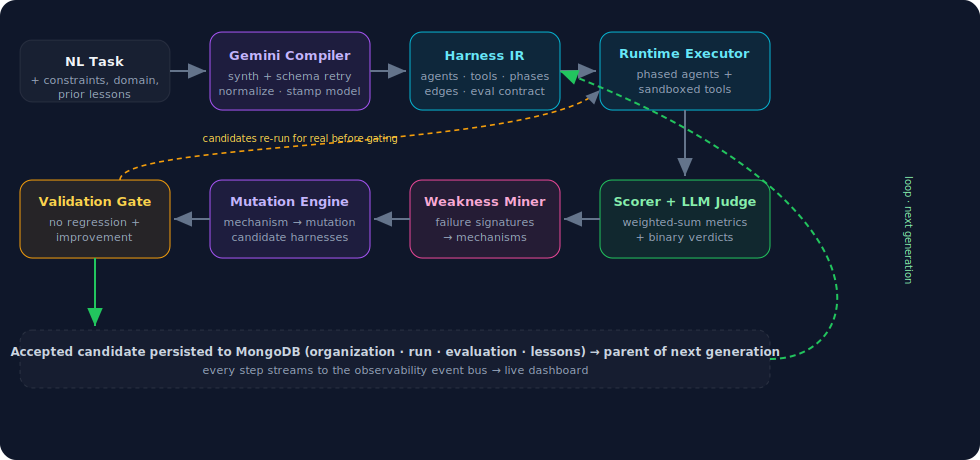
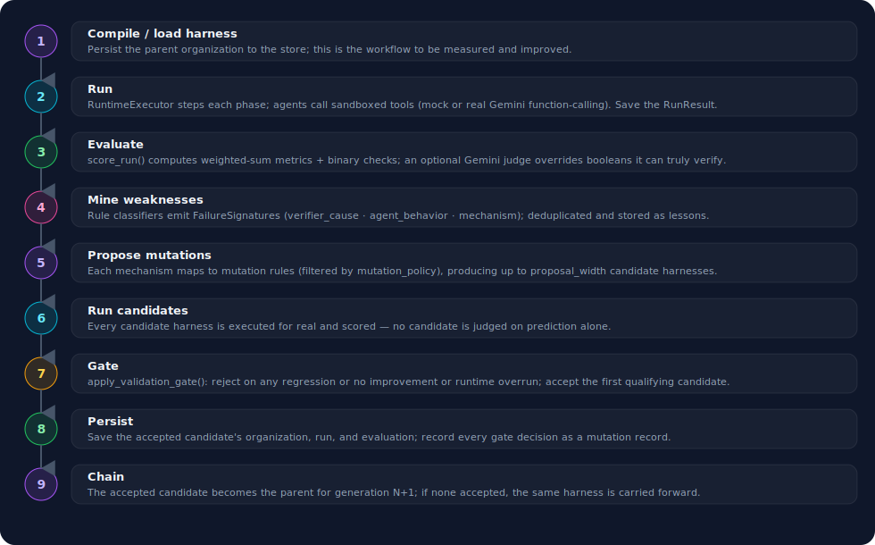
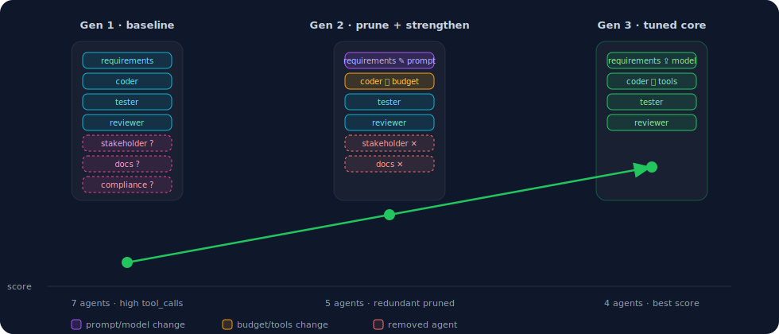

# Evolutionary AI Engineering Teams

> **Agent teams that design, run, evaluate, and improve themselves — from a plain-English task description.**

[](https://cerebralvalley.ai/e/aiewf-hackathon-2026)
[](https://python.org)
[](https://cloud.google.com/vertex-ai)
[](https://anthropic.com)
[](https://mongodb.com)

---

## Demo

> Click the thumbnail to watch the demo video

[](https://github.com/kaddynator/self-evolving-harness/blob/main/Evolutionary_AI_Engineering_Teams/dist/harness-demo.mp4)

| Design Studio | Live Evolution |
|:---:|:---:|
|  |  |
| Enter a plain-English task, pick a domain, hit Start | Live workflow graph, failure signatures, mutation gate |

---

## The Problem

Today's AI agents are powerful — but most multi-agent systems remain **fundamentally static**. Developers predefine the agents, assign their responsibilities, and manually design how they collaborate.

This works for predictable workflows, but **breaks down** when:
- Tasks are unfamiliar or underspecified
- Requirements evolve mid-run
- The right expertise wasn't anticipated at design time

**The result:** brittle pipelines that degrade silently, require manual intervention, and never learn from their mistakes.

---

## What We Built

A **self-evolving agent harness** — given a plain-English task, it:

1. **Compiles** a multi-agent team with no manual design (requirements → coder → tester → reviewer)
2. **Executes** agents against real tools, collecting a full execution trace
3. **Evaluates** output with a real LLM judge (Gemini 2.5 Flash or Claude Sonnet 4.6)
4. **Mines** failure signatures — wrong tool, oversized patch, late testing, redundant agent
5. **Proposes mutations** — swap a model, tighten a budget, add a verifier, reorder the team
6. **Gates** each mutation: only candidates that improve without regressing are promoted
7. **Repeats** — generation after generation, the team adapts on its own

When the evolved workflow is still wrong, humans label the correct output. That feedback builds an evaluation dataset, and the system uses it to re-evolve the workflow from the ground up.

---

## Architecture



The **Organization Harness IR** is the central data structure — a fully executable YAML spec defining agents, topology, evaluation criteria, and mutation policy. Every generation increments the version; the lineage is fully traceable by `organization.id`.

---

## How a Generation Works

Each evolution cycle runs 9 stages — compile, run, evaluate, mine, propose, run candidates, gate, persist, chain:



---

## How Workflows Evolve

Each accepted mutation changes one surface — a prompt, a budget, a tool, a model, or the agent roster. Scores climb as redundancy is pruned and weak agents are strengthened:



---

## Key Features

### 8 Mutation Operators
| Operator | What it does |
|---|---|
| `modify_prompt` | Strengthen or expand an agent's instruction via LLM |
| `change_model` | Upgrade to the next model tier (flash → pro) |
| `add_agent` | Insert a verifier or specialist into the workflow |
| `remove_agent` | Prune a redundant non-core agent |
| `adjust_budget` | Tighten max tool calls to force focused execution |
| `modify_tools` | Grant a missing tool permission |
| `reorder_edges` | Enforce correct execution order |
| `modify_runtime_policy` | Prevent identical retries, require artifact before finish |

### Validation Gate
Each mutation is run end-to-end and rejected if it:
- Exceeds the runtime budget
- Regresses any required metric (e.g. `tests_pass`)
- Fails to improve at least one tracked metric (e.g. `total_score`, `tool_calls`)

### Feedback Flywheel
When the evolved workflow is still wrong, a sentinel outside the harness captures the failure. Humans label the expected output, triggering re-evolution against the full labeled dataset — gate: no regression on all labeled cases → redeploy.

---

## Tech Stack

| Layer | Technology |
|---|---|
| **LLM — agents + judge** | Gemini 2.5 Flash (Vertex AI), Claude Sonnet 4.6 (Anthropic via Vertex) |
| **State & memory** | MongoDB Atlas — organizations, runs, evaluations, mutations, lessons, eval_cases |
| **Task similarity** | Qdrant — vector search for warm-start topology retrieval |
| **Topology gene pool** | Kuzu — embedded graph DB, agent topology lineage |
| **Run history & scoring** | ClickHouse — 90-day TTL, time-decay scoring (quality / cost) |
| **Infrastructure** | DigitalOcean Droplets + Docker |
| **Web UI** | FastAPI + SSE + Remotion (React) |

---

## Quick Start

### Prerequisites
- Python 3.11+
- `gcloud auth application-default login` (Gemini + Claude via Vertex AI)
- MongoDB Atlas URI

```bash
git clone https://github.com/kaddynator/self-evolving-harness.git
cd self-evolving-harness/Evolutionary_AI_Engineering_Teams

# Configure environment
cp .env.example .env
# Edit .env with your MONGODB_URI and other credentials

# Install dependencies
pip install -r requirements.txt
```

### Run the Web UI

```bash
python cli.py serve
# Opens http://localhost:8765
```

### Compile a Harness from Plain English

```bash
python cli.py compile "Add a rate limiter to the payments API" \
  --domain software_engineering \
  -o harness.yaml
```

### Run Evolution

```bash
python cli.py evolve harness.yaml --generations 5
```

---

## Web UI Tabs

| Tab | What it shows |
|---|---|
| **Configure** | Task input, domain, agent count, generations |
| **Monitor** | Live agent cards, tool call stream, artifacts |
| **Evolution** | Topology graph, mutation proposals, gate decisions |
| **Metrics** | Per-generation score table, metric breakdown |
| **Leaderboard** | Top workflows by avg score from ClickHouse |

---

## Project Structure

```
Evolutionary_AI_Engineering_Teams/
├── src/
│   ├── compiler/       # Synthesizes OrganizationHarness IR from plain-English task
│   ├── ir/             # Pydantic schema for the full harness IR
│   ├── runtime/        # Executor: runs agents phase by phase, collects trace
│   ├── evaluation/     # Scorer + LLM judge + validation gate
│   ├── weakness/       # Rule-based failure signature mining
│   ├── evolution/      # Mutation proposals + mutators (8 operators)
│   ├── memory/         # MongoDB, Qdrant, Kuzu, ClickHouse stores
│   ├── llm/            # Backend-neutral LLM client (Claude + Gemini)
│   ├── observability/  # EventBus, SSE server, web UI, eval dataset API
│   ├── eval_dataset/   # EvalCase model + production capture flow
│   └── pipeline.py     # Orchestrates compile → run → evaluate → evolve loop
├── assets/             # Architecture SVG diagrams
├── demos/harness-demo/ # Remotion + Kokoro TTS demo video pipeline
├── docs/               # 14 design docs + MASTER_RFC
├── examples/           # org spec + team v1/v2 YAML
├── cli.py              # CLI: compile / run / evolve / serve
├── docker-compose.yml
└── requirements.txt
```

---

## Documentation

| Doc | Description |
|---|---|
| [`docs/MASTER_RFC.md`](Evolutionary_AI_Engineering_Teams/docs/MASTER_RFC.md) | Full system RFC |
| [`docs/14_feedback_flywheel.md`](Evolutionary_AI_Engineering_Teams/docs/14_feedback_flywheel.md) | Production feedback flywheel design |
| [`docs/07_evaluation.md`](Evolutionary_AI_Engineering_Teams/docs/07_evaluation.md) | LLM judge + scoring details |
| [`docs/04_organization_ir.md`](Evolutionary_AI_Engineering_Teams/docs/04_organization_ir.md) | Harness IR schema reference |
| [`docs/06_evolution_engine.md`](Evolutionary_AI_Engineering_Teams/docs/06_evolution_engine.md) | Mutation operators + standing rules |

---

*Built for the [AI Engineer World's Fair Hackathon 2026](https://cerebralvalley.ai/e/aiewf-hackathon-2026)*
